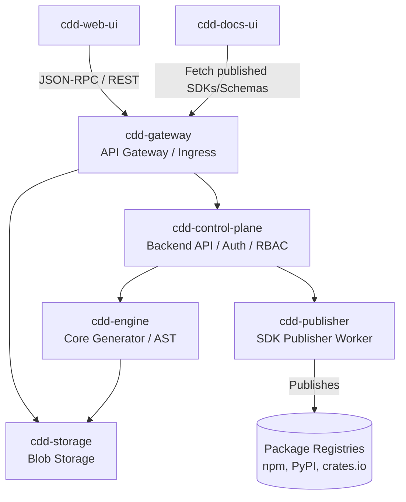

# Architecture: `cdd-storage`

`cdd-storage` is the blob persistence layer. 

## Responsibilities
- Receives completed builds (ZIPs, JSON schemas) from `cdd-engine` post-generation.
- Stores these artifacts securely mapped by `OrgID`, `RepoID`, and `ReleaseVersion`.
- Provides an extremely fast read path. When a user requests `mydomain.com/u/org/repo`, the gateway forwards the request to `cdd-web-ui` or `cdd-docs-ui`, which in turn requests the raw schema JSON from `cdd-storage` to perform the client-side render or display API documentation.

## Storage Backends
By abstracting the backend via a trait, `cdd-storage` can support:
1. Local File System (Development / On-Prem).
2. AWS S3 / Cloudflare R2 (SaaS / Cloud deployment).

## System Architecture

The following diagram illustrates `cdd-storage`'s role within the broader CDD ecosystem, serving both the generation engine and the frontend clients (like `cdd-web-ui` and `cdd-docs-ui`):

